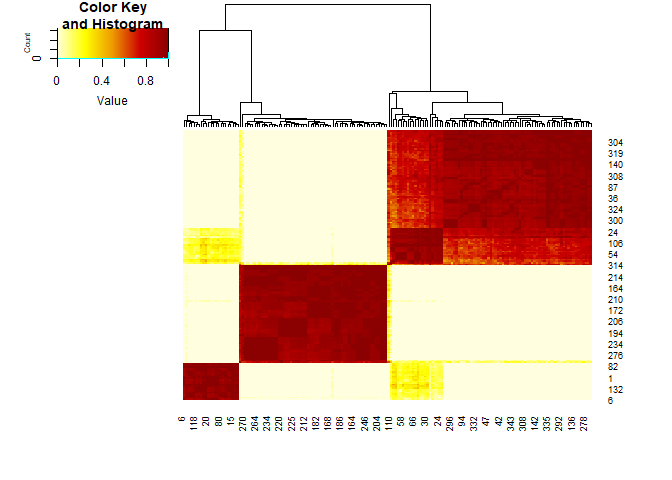

<!-- README.md is generated from README.Rmd. Please edit that file -->

# `clusteringRF`

<!-- badges: start -->

[](https://github.com/sistm/clusteringRF/actions/workflows/R-CMD-check.yaml)
<!-- badges: end -->

`clusteringRF` performs Random Forests of Divisive Monothetic
([`divclust`](https://github.com/chavent/divclust)) Trees for
Unsupervised Clustering.

## Installation

You can install the development version of clusteringRF from
[GitHub](https://github.com/).

`clusteringRF`depends on a custopmized implementation of the
[`divclust`](https://github.com/chavent/divclust) package, that must
first be installed with the following:

``` r
# install.packages("remotes")
remotes::install_github("sistm/divclust")
```

Then, `clusteringRF` can be installed with:

``` r
remotes::install_github("sistm/clusteringRF")
```

## Example

``` r
library(clusteringRF)
#> Le chargement a nécessité le package : parallel
library(palmerpenguins)
#> Warning: le package 'palmerpenguins' a été compilé avec la version R 4.5.3
#> 
#> Attachement du package : 'palmerpenguins'
#> Les objets suivants sont masqués depuis 'package:datasets':
#> 
#>     penguins, penguins_raw
mypeng <- as.data.frame(penguins)
mypeng$year <- factor(as.character(mypeng$year),
                         levels=c("2007", "2008", "2009"),
                         ordered=TRUE)

forest_clust <- clusteringRF(na.omit(mypeng[mypeng$sex=="male", -c(1, 7)]), ntrees = 50, ncores = 1)

resume <- summary(forest_clust)
plot(resume)
```


